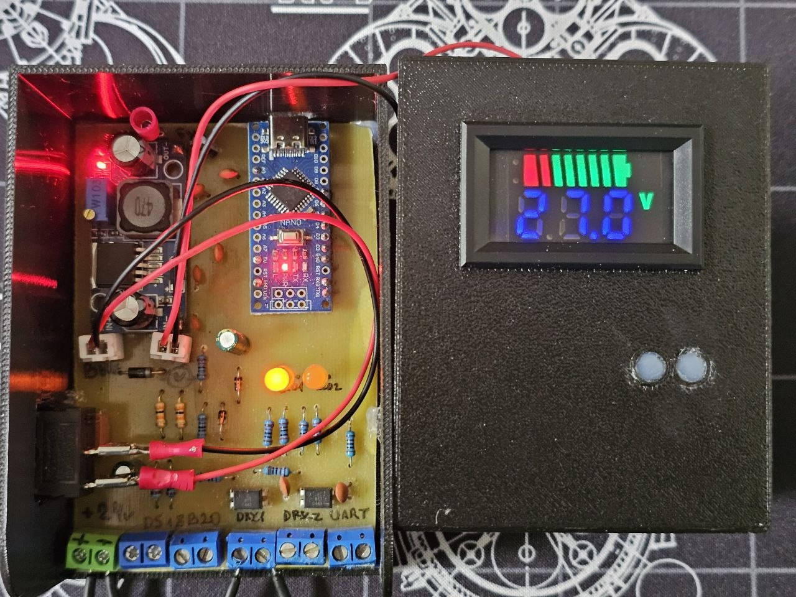
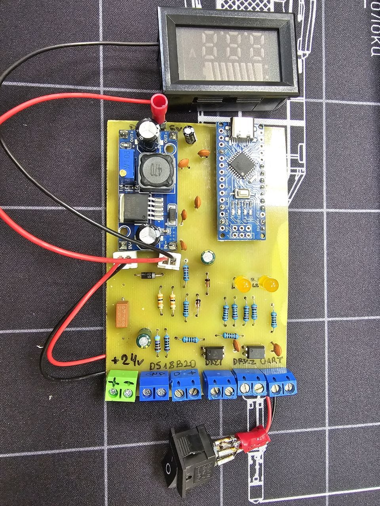
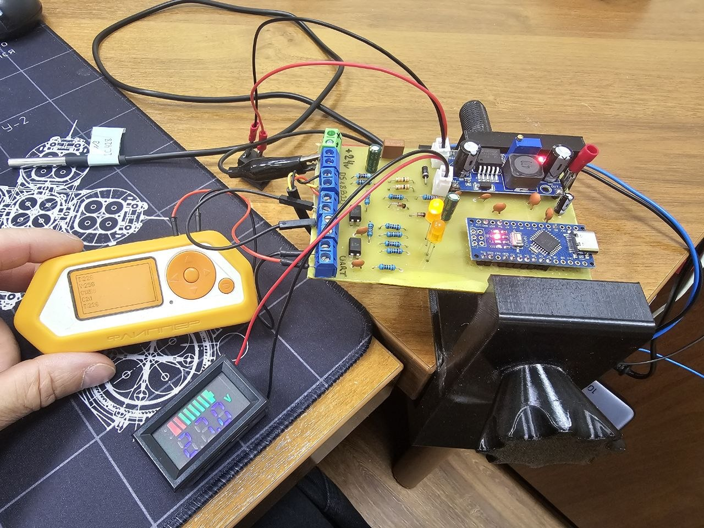
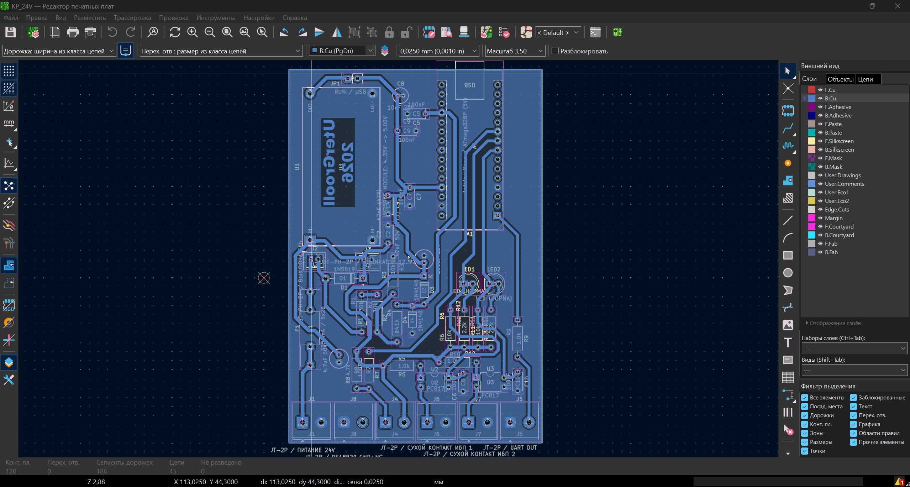
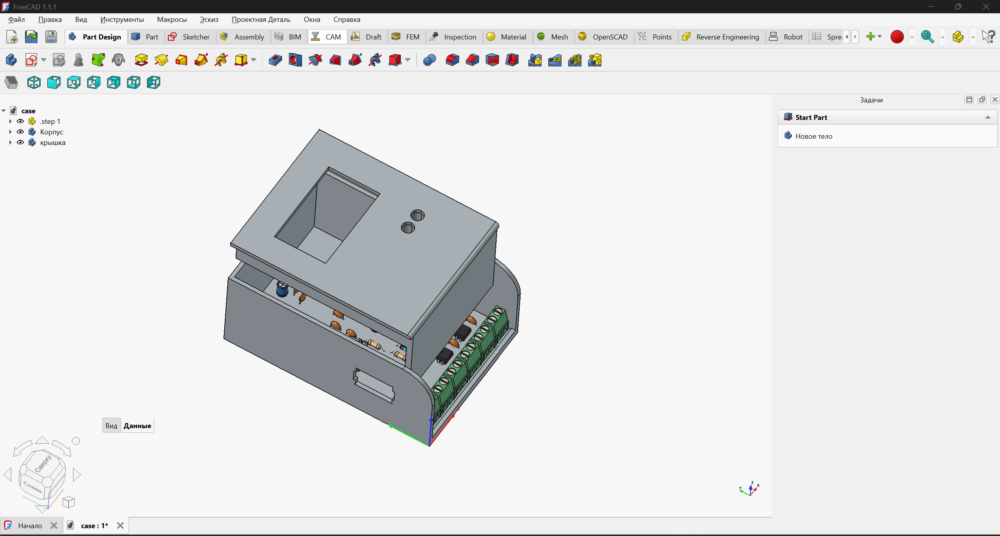

# UPS 24V Monitor

Контроллер мониторинга ИБП **Штиль PS2420G** на Arduino Nano: измерение напряжения шины 24 В, температуры АКБ и состояния двух сухих контактов. Данные передаются по UART на внешний контроллер для дальнейшего опроса из SCADA.



## Возможности

- Один канал измерения напряжения **0…30 В**.
- Внешний датчик температуры **DS18B20**.
- Два входа сухих контактов через **PC817** с LED-индикацией.
- Выход **UART 9600 бод**, значения в целочисленном формате.
- Питание через понижающий модуль **LM2596S**, выход 5 В.
- Корпусной индикатор напряжения и съёмный выключатель.
- Плата KiCad для одностороннего травления; корпус FreeCAD и файлы 3D-печати.

> Эта плата сама не реализует Modbus TCP и не подключается к Ethernet.
> UART принимает отдельный контроллер-шлюз. Два контакта ИБП не означают два независимых канала измерения напряжения — АЦП-канал здесь один.

## Аппаратная часть

| Узел | Исполнение |
| --- | --- |
| Контроллер | Arduino Nano, ATmega328P, логика 5 В |
| Питание | Шина ИБП около 27 В → LM2596S → 5 В |
| Делитель | 30 кОм + 30 кОм / 10 кОм, номинальный коэффициент 7 |
| Температура | DS18B20, трёхпроводное подключение |
| Дискретные входы | 2 × PC817 |
| Интерфейс | Однонаправленный TTL UART |
| Проект платы | KiCad 10 |
| Корпус | FreeCAD, 3MF |

### Выводы Nano

| Сигнал | Пин |
| --- | --- |
| Напряжение через делитель | A0 |
| DS18B20 DATA | D7 |
| Контакт ИБП 1 | D6 |
| Контакт ИБП 2 | D5 |
| UART TX | D1/TX |
| Общий провод | GND |

D0/RX для текущей прошивки не используется. Пины относятся к **измерительной Nano**, не к внешнему ПАК.

## Фотографии

| Плата | Проверка UART |
| --- | --- |
|  |  |

| Разводка | Корпус |
| --- | --- |
|  |  |

[Все фотографии и изображения](docs/images/) взяты из материалов сборки. Фото и скриншоты могут отражать промежуточные этапы; перед изготовлением сверяйте их с исходниками KiCad.

## Прошивка

Скетч: [firmware/KP_24V/KP_24V.ino](firmware/KP_24V/KP_24V.ino).

1. Открыть скетч в Arduino IDE.
2. Установить библиотеку **GyverDS18**.
3. Выбрать Arduino Nano и загрузчик, соответствующий установленной плате.
4. Проверить безопасное питание при USB-подключении, затем загрузить скетч.
5. Открыть монитор порта на **9600 бод**.

Библиотеки Ethernet и ModbusTCP_RU на этой Nano не требуются. Логика существующего скетча при подготовке репозитория не изменялась.

### Калибровка напряжения

В скетче сохранена двухточечная калибровка конкретного макета:

| Входное напряжение | Значение АЦП |
| --- | ---: |
| 5,0 В | 144 |
| 30,0 В | 880 |

Константы `VOLTAGE_CAL_LOW_DV = 50` и `VOLTAGE_CAL_HIGH_DV = 300` заданы в десятых долях вольта. Для другой платы и источника 5 В нужно повторить измерения и изменить калибровку. Шаг вывода 0,1 В не означает гарантированную точность 0,1 В.

## UART и SCADA

Пример потока:

```text
V:270
T:234
C1:0
C2:1
```

Это 27,0 В, 23,4 °C, нормальное состояние ИБП 1 и авария/размыкание контакта ИБП 2.

Полный формат, подключение и различия карт регистров внешних приёмников описаны в [docs/uart.md](docs/uart.md).

Для стендового Modbus TCP-приёмника используется отдельный проект [SCADA Modbus TCP Relay Timer](https://github.com/UterGrooll/scada-modbus-tcp-relay-timer) на базе [ModbusTCP_RU](https://github.com/UterGrooll/ModbusTCP_RU). Исходники этого приёмника не включены в данный репозиторий.

## Схема, плата и корпус

- [Проект KiCad](schematic/KP_24V/KP_24V.kicad_pro)
- [Принципиальная схема](schematic/KP_24V/KP_24V.kicad_sch)
- [Печатная плата](schematic/KP_24V/KP_24V.kicad_pcb)
- [Примечания по аппаратной части](schematic/KP_24V/README_CONTROLLER_RU.md)
- [Модель корпуса FreeCAD](case/case.FCStd)
- [Основание для печати](case/case-Body.3mf)
- [Крышка для печати](case/case-крышка.3mf)

Локальные библиотеки символов и посадочных мест сохранены рядом с KiCad-проектом; пути используют `${KIPRJMOD}`.

## Ограничения и безопасное подключение

- Перед установкой Nano настроить DC/DC на **5,00 В**. Не подавать 24–30 В непосредственно на вывод 5V или A0.
- Для USB Nano отключить внешние 24 В и снять **JP1** между OUT+ DC/DC и шиной +5 В. Проверить, что джампер действительно разрывает эту цепь на собранной плате.
- Перед изменением соединений отключить все источники питания, включая USB. Подпитка возможна и через сигнальные линии.
- PC817 не обеспечивает развязку всего устройства: GND питания, Nano и UART общий.
- UART рассчитан на короткое соединение; линия не является RS-232 или RS-485.
- В текущем скетче нет антидребезга контактов. После потери DS18B20 повторный запуск измерений не гарантирован: внешний приёмник должен контролировать свежесть каждого канала.
- Это авторский прототип мониторинга, а не устройство защиты АКБ или сертифицированный промышленный контроллер.

## Структура

```text
firmware/KP_24V/     Прошивка измерительной Nano
schematic/KP_24V/    KiCad: схема, PCB, локальные библиотеки
case/               FreeCAD и файлы корпуса
docs/images/        Фотографии и скриншоты сборки
docs/uart.md        Формат UART и интеграция
```

Резервные копии CAD, локальная история, старые отчёты, Word-документы и материалы «Подключение» исключены из Git.

